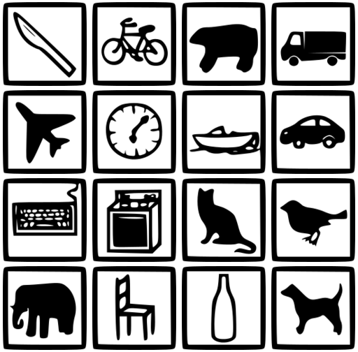

# Data and materials from  "Generalisation in humans and deep neural networks"

This repository contains information, data and materials from the paper "Generalisation in humans and deep neural networks" by Robert Geirhos, Carlos R. Medina Temme, Jonas Rauber, Heiko H. Schütt, Matthias Bethge, and Felix A. Wichmann.

A subset of the experiments described here reported in an earlier version posted on arXiv ("Comparing deep neural networks against humans: object recognition when the signal gets weaker", Geirhos et al., June 2017). In the more recent paper, we extend our previous work by additional image manipulations (now 83K instead of 40K psychophysical trials), more recent networks (ResNet instead of AlexNet) plus extensive results for testing generalisation performance of networks trained directly on distortions.

Please don't hesitate to contact me at robert.geirhos@bethgelab.org or open an issue in case there is any question!

This README is structured according to the repo's structure: one section per subdirectory (alphabetically).

## 16-class-ImageNet
Contains a `.txt` file with a mapping from all 16 employed entry-level MS COCO categories to the corresponding (fine-grained) ImageNet classes. Further information is provided in the file itself (`MSCOCO_to_ImageNet_category_mapping.txt`).

Beyond that, we provide one `.txt` file per category with all of the corresponding ImageNet image names (in the `image_names/` subdirectory. We preprocessed images from the ILSVRC2012 training database as described in the paper (e.g. we excluded greyscale images), retaining a total of 213,555 images. The `image_names/` subdirectory contains those final image names (the ones that were retained).

If you would like to use 16-class-ImageNet, we suggest the following workflow:
First of all, you will need to obtain the ImageNet images from the [ImageNet website](http://image-net.org/download.php).

Then, if you want to use 16-class-ImageNet as in our paper (e.g. for comparability):
Sort those images into 16 entry-level classes by the filenames provided in `image_names/`. Note that this folder contains only the image names used in our experiments, i.e. greyscale images, for example, are exluded here.

If, however, you do not want to exlude greyscale images etc., and just use 16 classes with all of their images, you can use the mapping provided in `MSCOCO_to_ImageNet_category_mapping.txt` to group the ImageNet categories into 16 entry-level categories.

## code
This subdirectory contains all image manipulation code used in our experiments (conversion to grayscale, adding uniform noise, ...). The main method of `image-manipulation.py` walks you through the various degradations. Note that the eidolon manipulations that we use in our experiments is based on the [Eidolon github repository](https://github.com/gestaltrevision/Eidolon), which you will need to download / clone if you would like to use it. We found and fixed a bug in the Python version of the toolbox, for which we created a pull request in August 2016 (`Fixed bug in partial coherence #1`) which has not been merged (as of May 2018). Make sure to collect the files from the pull request as well, otherwise you will get different images!

#### accuracy_evaluation
This subdirectory contains the code that was used to evaluate networks with a ResNet-50 architecture trained on 16-class-ImageNet. Its `predict.py` file contains a minimal example; `evaluate.py` the actual code used to evaluate the networks on images.

## data-analysis
The `data-analysis/` subdirectory contains scripts that can be used to plot and analyze the data contained in `raw-data/`. We used R version 3.2.3 for the data analysis. Beyond that, `data-analysis/` contains functionality to plot three example stimuli images at all stimuli levels used in the experiments (for all of the image manipulations).

## figures
Contains all figures of the paper. All figures reporting results can be generated by the scripts in `data-analysis/`.

## lab-experiment

#### experimental-code
Contains the main MATLAB experiment, `object_recognition_experiment.m`, as well as a `.yaml` file for every experiment. In the `.yaml` file, the specific parameter values used in an experiment are specified (such as the stimulus presentation duration). Some functions depend on our in-house iShow library which can be obtained from [here](http://dx.doi.org/10.5281/zenodo.34217).

#### helper-functions
Some of the helper functions are based on other people's code, please check out the corresponding files for the copyright notices.

#### response-screen-icons
The response screen icons appeared on the response screen, and participants were instructed to click on the corresponding one. The icons were taken from the [MS COCO website](http://mscoco.org/explore/).

## raw-accuracies
The `raw-accuracies/` directory contains a `.txt` file for each experiment with a table of all accuracies (split by experimental condition and subject/network). This therefore contains the underlying data used for all accuracy plots in the paper, and may be useful, for example, if one would like to generate new plots for comparing other networks to our human observers' accuracies. Note that all accuracies reported in these files are percentages.

## raw-data
This directory contains the raw data for all experiments reported in the paper, including a total number of 82,880 human trials in a controlled lab setting. This directory has three subdirectories: `humans/` for human data, `TF/` for data from pre-trained networks (evaluated with TensorFlow, hence the abbreviation), and `fine-tuning/`. This third directory contains data from our network training experiments (ResNet-50 trained on a potentially distorted version of 16-class-ImageNet). Note that the directory name may be somewhat misleading, as the networks were trained from scratch rather than fine-tuned.

Every `.csv` raw data file has a header with the **bold** categories below, here's what they stand for:

- **subj:** for DNNs (Deep Neural Networks), name of network; for human observers: number of subject. This number is consistent across experiments. Note that the subjects were not necessarily given consecutive numbers, therefore it can be the case that e.g. \'subject-04\' does not exist in some or all experiments.

- **session:** session number

- **trial:** trial number

- **rt:** reaction time in seconds, or \'NaN\' for DNNs

- **object_response:** the response given, or \'na\' (no answer) if human subjects failed to respond

- **category:** the presented category

- **condition:** short indicator of the condition of the presented stimulus. Color-experiment: \'cr\' for color, \'bw\' for grayscale images; contrast-experiment: \'c100\', \'c50\', ... \'c01\' for 100%, 50%, ... 1% nominal contrast; noise-experiment: \'0\', \'0.03\', ... \'0.9\' for noise width; eidolon-experiment: in the form \'a-b-c\', indicating:
	- a is the parameter value for \'reach\', in {1,2,4,8,...128} 
	- b in {0,3,10} for coherence value of 0.0, 0.3, or 1.0; these are refered to as Eidolon III, Eidolon II and Eidolon I in the paper.
	- c = 10 for grain value of 10.0 (not varied in this experiment)

- **imagename:**

e.g. `3841_eid_dnn_1-0-10_knife_10_n03041632_32377.JPEG`

This is a concatenation of the following information (separated by \'_\'):

1. a four-digit number starting with 0000 for the first image in an experiment; the last image therefore has the number n-1 if n is the number of images in a certain experiment
2. short code for experiment name, e.g. \'eid\' for eidolon-experiment
3. either e.g. \'s01\' for \'subject-01\', or \'dnn\' for DNNs
4. condition
5. category (ground truth)
6. a number (just ignore it)
7. image identifier in the form a_b.JPEG (or a_b.png), with _a_ being the WNID (WordNet ID) of the corresponding synset and _b_ being an integer.

Note that we collected human data for the contrast-experiment with both `JPEG` and `png` images, as explained in the paper. The experiment name `contrast-experiment` refers to data obtained with `JPEG` images (5 observers); the name `contrast-png-experiment` refers to data obtained with `png` images (3 observers, a subset of the 5 observers for the experiment with `JPEG` images).

Additionally, all `.csv` files belonging to the used pretrained DNNs, have a few extra columns (only `object_response_sums` and `entropy_1000` were used). The suffix $\_16$ indicates that the respective measure was taken over our 16 entry-level categories, "\_1000" indicates calculation over the 1000 ImageNet classes.

- **object_response_sums:** the networks response, when summing over the predictions mapping to a certain of our entry-level categories. 

- **entropy_1000:** the prediction entropy between the 1000 ImageNet classes (as measure of uncertainty)

- **entropy_16:** the prediction entropy between our 16 entry-level categories (as measure of uncertainty)

- **highest_prob_16:** the highest probability belonging to one of our 16 entry-level categories (as measure of uncertainty)

- **prob_correct_16:** the probability of the correct category (as measure of performance)

- **rank_correct_16:** the rank of the correct category's softmax value within the 16 entry-level categories (performance measure)

- **<measure\>\_sums:** same measures as above, but when summing over probabilities mapping to the same entry-level category
